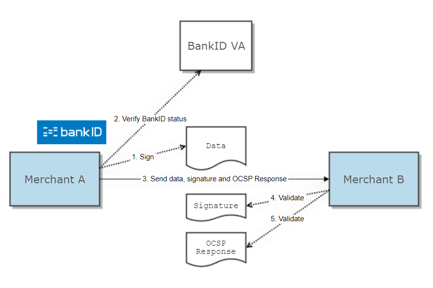
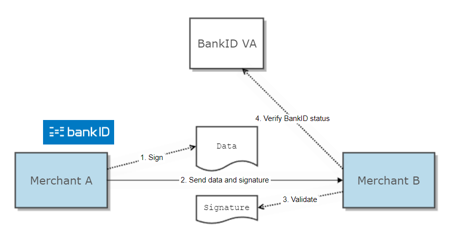
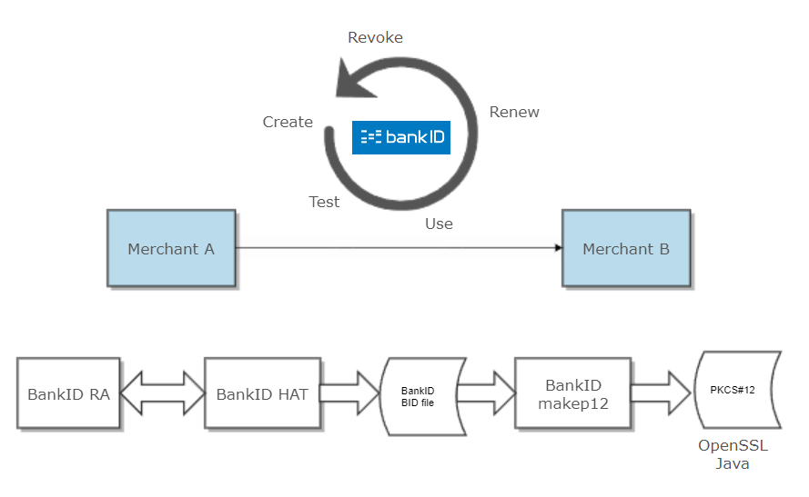

# BankID Open B2B Description
BankID OpenB2B  is a specific packaging of documentation, tools and example code on how to use BankID merchant certificates for B2B signing applications without the need to install or use any software from BankID

This page describes the BankID Open B2B packaging, ie. a set of documentation, tools and example code on how to use BankID merchant certificates in business-to-business scenarios. An Open B2B BankID consists of industry compliant X.509 certificates, and can be used without the need for installed BankID software. The target audience of this document is merchant project teams: Technical personnel designing and coding the use of BankID Open B2B. 
## Concepts and abbreviations

| Name       | Description                                                                                                                                                                                           |
|------------|-------------------------------------------------------------------------------------------------------------------------------------------------------------------------------------------------------|
| BankID CA  | Certification Authority: The originator's system for issuing BankIDs.                                                                                                                                 |
| BankID RA  | BankID Registration Authority: The originator's system for handling the lifecycle of BankIDs.                                                                                                         |
| BankID VA  | BankID Validation Authority: The originator's system for online checking the revocation status of a BankID.                                                                                           |
| CN         | Common Name: A field in the X.509 certificates of an BankID identifying the merchant.                                                                                                                 |
| CSR        | Certificate signing request: A request for a BankID CA to sign a certificate stating that the Common Name of an merchant is coupled to a BankID (i.e. coupled to a specific public/private key pair). |
| OCSP       | Online Certificate Status Protocol.                                                                                                                                                                   |
| Originator | Issuer of an BankID.                                                                                                                                                                                  |

## BankID Open B2B scenarios

An Open B2B BankID is a standard X.509 certificate and can be used in many ways. However, there are a couple of use cases that are especially relevant. Both use cases relates to signing data sent from merchant A to merchant B. Sending data signed with an Open B2B BankID ensures that the receiver can verify that:

The data are not changed under transport.

The identity of the sender is genuine and non-reputable.

There are two scenarios for verifying data integrity and sender identity. Both implies that the signature itself is validated, this is done offline by the receiver. Further, to be sure the signature is made with a valid BankID, the status of the signing BankID must be verified online with BankID VA.

For both scenarios it is the merchant verifying BankID status that are charged for the status check.

### Scenario: Sender verifies BankID status

When merchant A checks its own BankID status with BankID VA (2), merchant A will get a signed OCSP response in return. The OCSP response is sent to merchant B together with the data and the signature itself. Merchant B must validate, offline, both the signature (4) and the OCSP response's signature (5).

### Scenario: Receiver verifies BankID status

Merchant B checks merchant A's BankID status with BankID VA (4).

### Comparison of scenarios

The two most important factors to be considered when choosing between these two scenarios are therefore:

Which merchant should be charged for the status checks?

Which merchant shall integrate with BankID VA?

Another aspect to consider is the long term validity of the BankID status check, which is better with the "sender verifies" approach. This is because the status check is performed at the time of signing. If the signing BankID is revoked later, the OCSP response still shows the BankID was valid at time of signing. This difference is subtle, but may be a concern if the receiver, Merchant B, performs the status check long time (relatively) after Merchant A has sent the data. This can be relevant in batch oriented systems.

## Example code

Example code supporting both the usage scenarios and the Open B2B BankID lifecycle are located in this GitHub repository, on the master branch. The usage examples are in Java.

## BankID lifecycle overview

This chapter describes the lifecycle of an Open B2B BankID. Online tools and/or example code required in each phase of the lifecycle are also referenced here.

## Create

### Order

The first step to create a fully functional (active) BankID is to submit an order to the originator's BankID RA. Inputs to the order are the merchants organization name and Common Name for the BankID. The order results in an activation URL and a shared secret, both to be used for activation of the BankID, see next chapter.

#### PREPROD

A [self-service BankID RA in preprod](https://ra-preprod.bankidnorge.no/#/search/orgNr) is available to help to issue BankID merchant certificates for testing. Note that this tool optionally support immediate activation of the certificate. Order and activation can also be done with BankID HAT tool.

#### PROD

Production BankIDs must be ordered from a reseller or from BankID Norge.

### Activate

Before the BankID can be used it must be activated. This means acquiring a X.509 certificate with the merchant's CommonName coupled to the merchant's public key, where the corresponding private key is known to the merchant only. This is done by:

1. Use BankID HAT tool to generate priv/public keypair and request a certificate, keys and certificate are stored in a BankID BID file.

2. Use the tool makep12 to convert the BID file to PKCS#12 format. (See below for usage instructions)

3. The PKCS#12 file will contain the signing keypair, the signing certificate and the certificate of the issuing CA. The private key has label/key alias "signkey" in the resulting PKCS#12 file.

Usage of BankID HAT tool is described here: [BankID HAT UserGuide - Kiev-Open (COI)](https://confluence.bankidnorge.no/confluence/kiev-open/bankid-hat-userguide)

The result of a successful activation and conversion with makep12 is a standard PKCS#12 keystore for signing purposes. The merchant's certificate is the end entity of this chain. The merchant's certificates has key usage:

Signing: Non Repudiation

BankID makep12

When ordering and activating a B2B BankID with HAT, HAT creates a special keystore-format, this keystore is called a BID file.

makep12 is a small java tool that converts this format to a standard PKCS#12 keystore. Makep12 can be found as a zip archive [here](../makep12/)

In order to use the tool, you will need to have JAVA_HOME and PATH setup correctly. Minimum required java version is 1.8.

To run it, unpack the zip file and run:

cd <makep12 directory>

Linux: ./bin/makep12 <bidfile>

Windows: bin/makep12.bat <bidfile>

makep12 will then read the bidfile and convert it to PKCS#12, the resulting file will be stored as <bidfile prefix>-sign.p12

The resulting .p12 file can then be used by e.g. java to do sign/verification using the private/public key and certificate chain.

## Test

The Open B2B BankID can be tested with the integration tests found in BankID BankAxept's GitHub repository.

## Use

Typical tasks in the usage scenarios are:

Sign data to be sent to another merchant

Get signed status check of BankID

Create detached signature: Package merchant signature and status check into a Cryptographic Message Syntax (PKCS#7) format

Send data and detached signature to another merchant

Check validity of senders BankID

Example code for all these tasks are found in this GitHub repository. To run the test code with maven, just write "mvn clean verify" 

## Renew

The BankID expires after 4 years. Before this happens the BankID must be renewed. Renewal should be done through BankID HAT.

## Revoke

If a BankID is not to be trusted anymore because it's integrity is broken, it must be revoked.

### PREPROD

Please use the [self-service BankID RA in preprod](https://ra-preprod.bankidnorge.no/#/search/orgNr) to revoke BankID merchant certificates for testing.

### PROD

Please contact your reseller or BankID Norge to revoke a BankID merchant certificate in production.

## Appendix A: Keystores and trust

For general guidance how to use Java trust stores, see the [X509TrustManager chapter in Java Secure Socket Extension (JSSE) Reference Guide.](http://docs.oracle.com/javase/8/docs/technotes/guides/security/jsse/JSSERefGuide.html#X509TrustManager)
## Trust stores

### BankID CA trust

Data sent from one merchant to another is signed with a merchant BankID. Verifying such signatures requires that the BankID root Certificate Authority (CA) is registered as a "trust anchor", see [TrustAnchor chapter in Java PKI Programmer's Guide.](http://docs.oracle.com/javase/8/docs/technotes/guides/security/certpath/CertPathProgGuide.html#TrustAnchor)

The example code loads the trust anchor from a hardcoded BankID root CA certificate.

### BankID VA (OCSP responder) trust

BankID status online check is done with an OCSP request to the VA. Verifying the OCSP response requires the VA's certificate to be registered as "OCSP responder certificate".

The example code loads the OCSP responder from a hardcoded VA certificate. Denne mangler for PROD i eksempelkoden.

### BankID VA SSL trust

BankID status online check is done with an OCSP request to the VA over Secure Socket Layer (SSL). The SSL-certificate for VA is issued by the BankID root Certificate Authority (CA).

The example code loads the BankID root CA certificate into the JSSE-stack from a Java keystore.

## Merchant Open B2B keystore

When signing data (which can be arbitrary data for sending to another merchant or a VA OCSP request) a merchant must use it's private key.

The example code loads the merchant certificate and private key from a Java keystore.